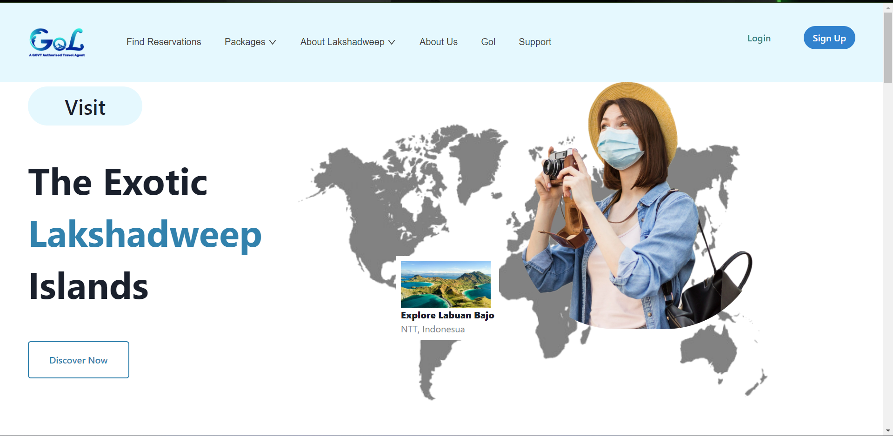
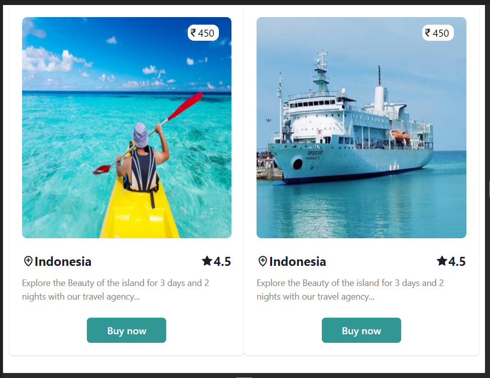

# Agumentik-task

## Project Details

Gol is a digital platform to connect tourists with holiday services providers in the U.T. of Lakshadweep.

#### <a href="https://frontend-murex-xi.vercel.app/">Want to see live preview >></a>

#### Desktop Screen

#### Tablet Screen

#### Mobile Screen

## Install

To install all the dependences of the project, run the following command:

    git clone https://github.com/Nitesh-Samaniya/Agumentik-task.git
    cd backend
    npm install
    cd ../frontend
    npm install

© 2022 Nitesh Samaniya